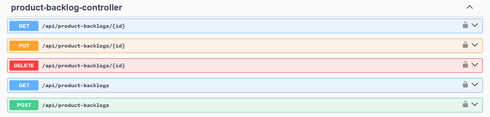
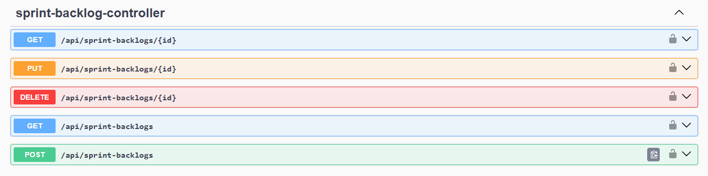
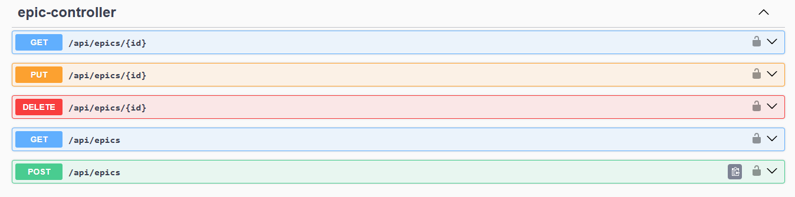
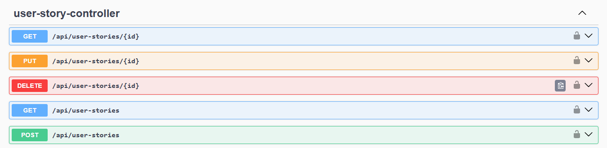
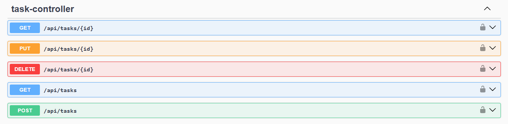
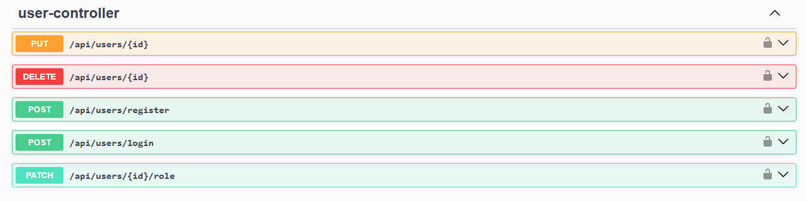

# 🧩 Agile Project Management RESTful API

<br/>

## 🌍 About

This **RESTful API** helps **Product Owners**, **Scrum Masters**, and **Developers** efficiently manage and track the progress of **tasks** and **User Stories** throughout the lifecycle of an **Agile project**.

<br/>

## 🎯 Main Objectives

- Track **Product Backlogs** and **Sprint Backlogs**.  
- Organize and prioritize **User Stories** by **Epics**.  
- Manage **Tasks** linked to **User Stories** and track their states: *To Do*, *In Progress*, *Done*.  
- Plan and monitor **Sprints**.

<br/>

## 🧩 Main Endpoints (Swagger UI)

Here is an overview of the API endpoints displayed through Swagger:

### product-backlog
<p align="center">
  
</p>

### sprintbacklog
<p align="center">
  
</p>

### epic
<p align="center">
  
</p>

### user-story
<p align="center">
  
</p>

### task
<p align="center">
  
</p>

### user
<p align="center">
  
</p>

<br/>

## 🧱 Architecture & Technologies

| Layer | Technology | Role |
|-------|-------------|------|
| **Main Framework** | Spring Boot | Quick setup, dependency management |
| **Web Layer** | Spring Web | Exposes REST endpoints |
| **Service Layer** | Java + Spring | Contains business logic |
| **Data Layer** | JPA + Hibernate + MySQL | Data persistence |
| **Security Layer** | Spring Security + JWT | Authentication & authorization |
| **Mapping Layer** | MapStruct / ModelMapper | DTO ↔ Entity conversion |
| **Documentation** | Springdoc OpenAPI (Swagger UI) | Interactive API documentation |
| **Productivity Tools** | Lombok, DevTools | Simplify and speed up development |
| **Testing** | JUnit, Mockito | Unit and integration testing |

<br/>

## 🧩 DTOs

| DTO | Fields |
|------|--------|
| **DescriptionDTO** | `id`, `role`, `besoin`, `raison` |
| **User** | `id`, `name`, `email`, `passwd`, `role`, `version` |
| **UserStoryDTO** | `id`, `titre`, `priorite`, `statut`, `description`, `taskIds`, `sprintBacklogId`, `epicId`, `productBacklogId` |
| **TaskDTO** | `id`, `titre`, `description`, `statut`, `userStoryId`, `sprintBacklogId` |
| **SprintBacklogDTO** | `id`, `nom`, `datedebut`, `datefin`, `userStoryIds`, `taskIds` |
| **ProductBacklogDTO** | `id`, `nom`, `userStoryIds`, `epicIds` |
| **EpicDTO** | `id`, `titre`, `description`, `userStoryIds`, `productBacklogId` |
| **LoginRequest** | `email`, `password` |

<br/>

## 🚀 Run the Project

```bash
git clone https://github.com/zinaakhtat/RestApiProject.git
cd RestApiProject
mvn spring-boot:run
```

## 🤝 Contributing

1. **Fork** the repository

2. **Create a new branch** for your feature

```bash
git checkout -b feature/AmazingFeature
```

3. **Commit** your changes

```bash
git commit -m "Add AmazingFeature"
```

4. **Push** to the branch

```bash
git commit -m "Add AmazingFeature"
```

5. **Open** a Pull Request

<br/>

## 📄 Licence

This project is licensed under the MIT License.
See the [LICENCE](licence) file for more details.

<br/>

